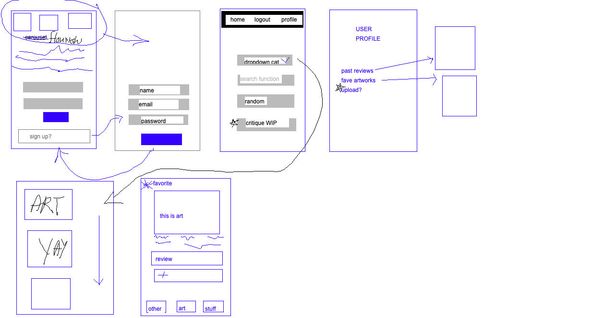
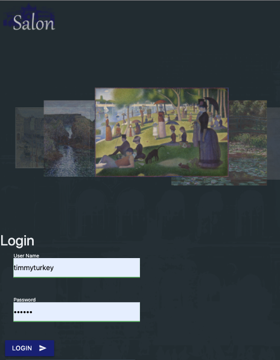
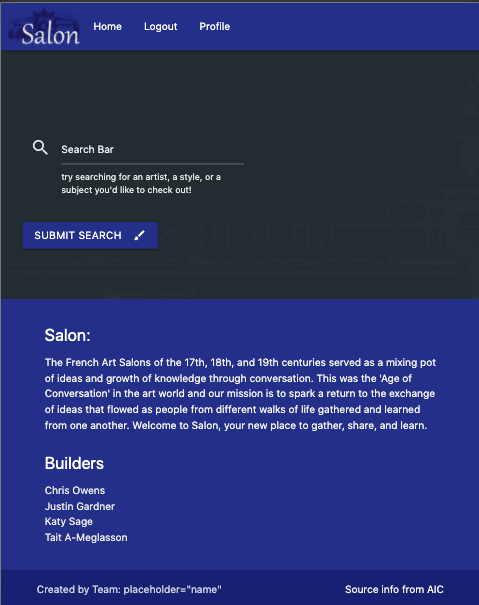
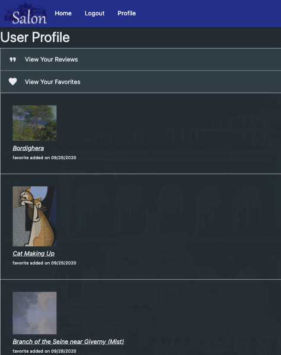
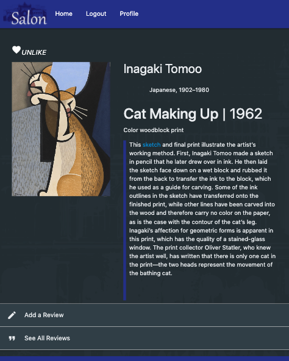
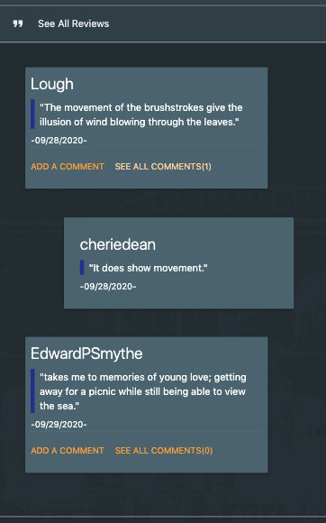

## Project title
Salon

## Description
Node.js and Express application to display art using a RESTful API to populate art and POSTGRESql database to store user interaction.

## Motivation
The French Art Salons of the 17th, 18th, and 19th centuries served as a mixing pot of ideas and growth of knowledge through conversation. This was the 'Age of Conversation' in the art world and our mission is to spark a return to the exchange of ideas that flowed as people from different walks of life gathered and learned from one another. Welcome to Salon, your new place to gather, share, and learn.

## Challenges and Solutions
- One challenge we faced was recovering the user id to display a profile for each specific user.
    - This was solved by creating sessions and storing the user id and username at the initiation of each login. 
    
- We were limited by the amount of images we could display on screen while still being user-friendly and mobile-friendly.
    - We solved this by creating pagination, and limited the API so that only 10 images displayed per screen load.

- Adding comments to a specific review was a challenge. Without it we felt it would not create enough user interaction.
    - To create a solution for this, we created a seperate table and foreign-key in our database referencing the specified review.

## Screenshots







## Tech/framework used
- [Node.js](https://expressjs.com/)
- [Express](https://nodejs.org/en/)
- [POSTGRESql](https://www.postgresql.org/)
- [HTML5](https://developer.mozilla.org/en-US/docs/Web/Guide/HTML/HTML5)
- [CSS3](https://developer.mozilla.org/en-US/docs/Archive/CSS3)
- [Javascript ES6](https://www.javascript.com/)

<b>Built with</b>
- [Materialize](https://materializecss.com/)

## Features
- Our project utilizes dynamically populated reviews, favorites, and comments. This allows greater interpersonal interaction and encourages a sharing of ideas reminiscent of those in the Parisian Salons of old. 
- Utilization of the Art Institute of Chicago's API allows users to search specific artists, subjects, or styles to find artwork suiting their particular needs. The broad scope of artwork also enables discovery of new favorites. 

## Future Goals
- In the future, we hope to implement:
    + an activity tab to show users' recent favorites and comments to encourage active discourse
    + title references in the users' profile along with their respective comments
    + an upload function for users to share their recent works in progress, allowing for critiques and comments during the artistic process

## API Reference

<a href="https://api.artic.edu/docs/">The Art Institute of Chicago® API</a>
<!-- ## Tests
Describe and show how to run the tests with code examples. -->

## How to use?
To run this project, install it locally using npm:

```
$ cd ../salon
$ npm install
$ npm start
```
<!-- ## Contribute

Let people know how they can contribute into your project. A [contributing guideline](https://github.com/zulip/zulip-electron/blob/master/CONTRIBUTING.md) will be a big plus. -->

## Credits
<a href="https://github.com/TaitLoughridge">Tait A-Meglasson</a>
<a href="https://github.com/KatySage">Katy Sage</a>
<a href="https://github.com/JustinSGardner">Justin Gardner</a>
<a href="https://github.com/chrisowensdev">Chris Owens</a>

## License
The data in this API response is licensed under a Creative Commons Zero (CC0) 1.0 designation and the Terms and Conditions of artic.edu.

    https://creativecommons.org/publicdomain/zero/1.0/
    https://www.artic.edu/terms"